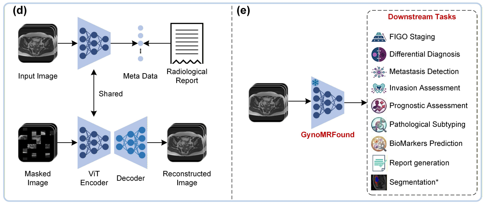

# An MRI Foundation Model for Versatile Clinical Applications in Gynecological Cancer via Report Metadata Learning (GynoMRFound)

## Framework and tasks



## ⚡️ Installation

For an editable installation, use the following commands to clone and install this repository.

```bash
conda create --name GynoMRFound python==3.12
conda activate GynoMRFound

git clone https://github.com/khtao/GynoMRFound.git
cd GynoMRFound
pip install -r requirements.txt
git clone https://huggingface.co/khtao/pretrained_models
```

## 🚀 Inference with GynoMRFound

Make the necessary modifications to create_feature_data.py to load the necessary data and generate the feature dataset.

```bash
python create_feature_data.py
```

